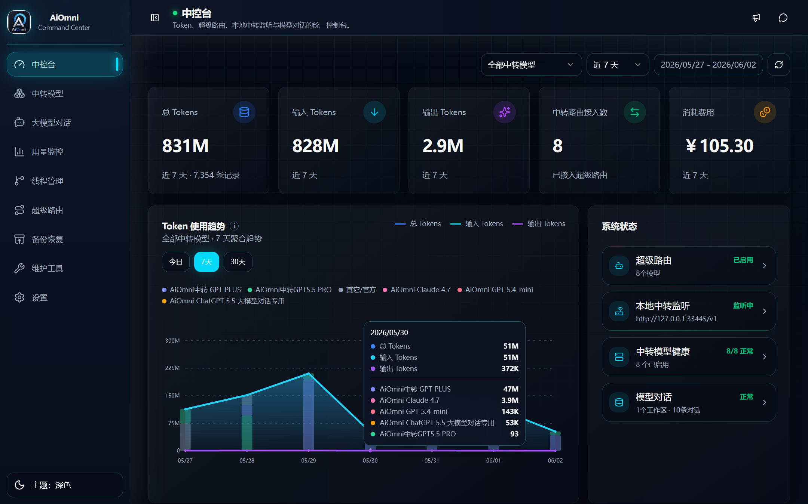
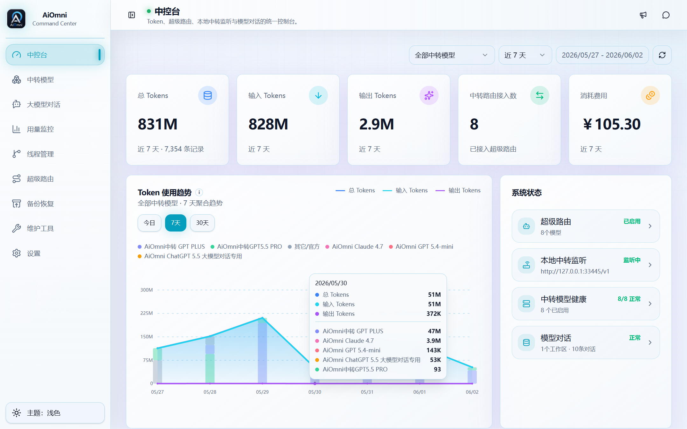
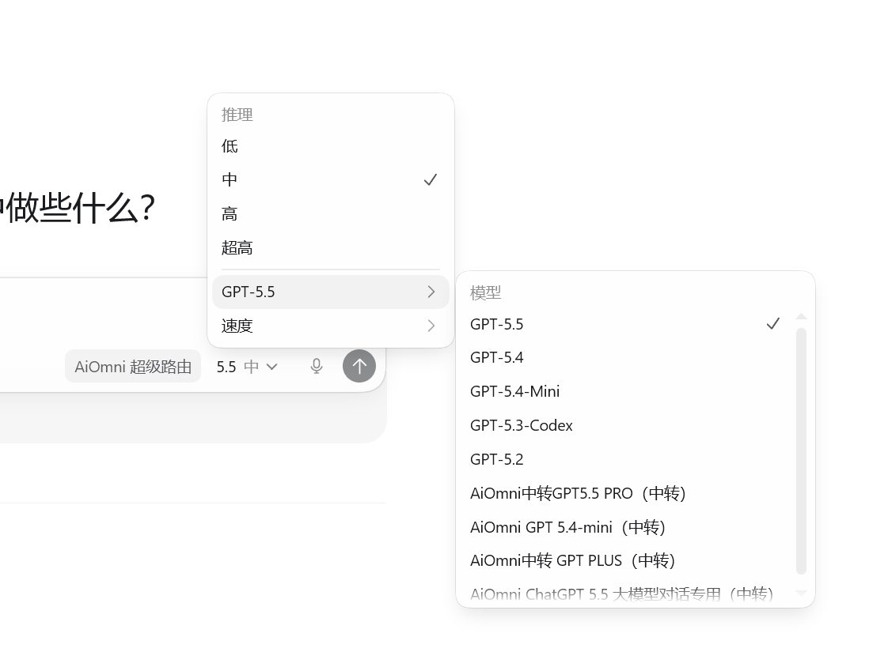
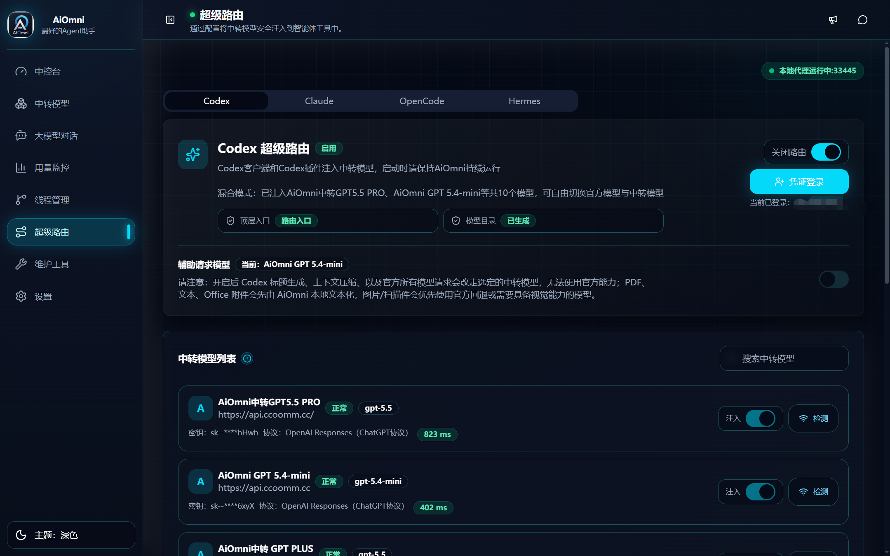

# 智用AiOmni 产品介绍

智用AiOmni 是一个面向 AI 重度使用者的本地桌面中控台，聚焦三件事：管理中转模型、接入 Agent 工具、看清 Token 与配置风险。它不是单一聊天客户端，也不是远程管理后台，而是把本地配置、模型路由、线程恢复和用量统计放在同一个安全可控的桌面应用里。

> 说明：AiOmni 的核心价值来自本地桌面能力。多数涉及密钥、安全存储、Codex / Claude Code / Hermes / OpenCode 配置、线程文件和本地数据库的功能，需要在 Tauri 桌面端运行。

## 产品愿景

AI 工具链正在变得越来越分散：中转站越来越多，模型越来越多，Agent 工具越来越多，用量来源也越来越多。真正的问题不再只是“能不能调通一个模型”，而是：

- 哪些 Provider 可用，哪些已经失效？
- 哪个模型正在被 Codex、Claude Code、Hermes 或 OpenCode 使用？
- 这次 Token 消耗来自聊天、Relay、外部 Usage API，还是 Codex 本地记录？
- 修改配置前有没有备份，出问题后能不能回滚？
- 被隐藏或误删的线程还能不能找回来？

AiOmni 的目标，是把这些高频但分散的操作集中到一个本地中控台里，让使用者更快接入模型、更安全地修改配置、更清楚地理解成本和线程状态。
并且现已实现codex官方账号与中转路由共存，且随时切换。

## 产品截图

  
  
  
  

## 目标用户

| 用户类型 | 典型需求 |
| --- | --- |
| 个人开发者 | 管理多个中转站和模型，在本地安全保存密钥，并快速接入 Codex 等 Agent 工具。 |
| Agent 高频用户 | 需要在 Codex、Claude Code、Hermes、OpenCode 之间切换 Provider，并希望保留诊断和回滚能力。 |
| 小团队或工作室 | 需要统计 Token 和费用，区分不同来源的用量记录，降低模型成本不透明带来的风险。 |
| 运维与支持人员 | 需要排查 Codex Home、账号注册表、线程索引、本地数据库、路由和代理配置问题。 |
| 中转模型使用者 | 需要批量导入导出 Provider，维护模型列表、健康状态、延迟和计费默认值。 |

## 一句话定位

AiOmni 是本地桌面端的 AI 中转、Agent 路由与用量管理中控台。

它将以下能力合并到一个界面：

- 中转 Provider 管理。
- Agent 工具超级路由。
- 本地大模型对话。
- Token 与费用统计。
- Codex 线程治理。
- 配置备份与恢复。
- 系统诊断与维护。

## 功能模块总览

| 模块 | 面向问题 | 核心能力 |
| --- | --- | --- |
| 中控台 | 当前系统状态是否健康？ | 汇总 Provider、聊天、用量、本地 Relay、超级路由和线程状态。 |
| 中转模型 | 如何统一管理多个中转站？ | 新增、编辑、删除 Provider，拉取模型，健康检查，延迟测试，计费配置，导入导出。 |
| 大模型对话 | 如何直接使用已接入模型？ | 基于中转 Provider 对话，支持工作区、会话、附件、图片、Markdown 和流式输出。 |
| 用量监控 | Token 和费用消耗来自哪里？ | 汇总外部 Usage API、本地 Relay、聊天记录与 Codex token 记录。 |
| 线程管理 | Codex 线程如何搜索、删除和恢复？ | 扫描线程索引，按项目展示，软删除，回收站恢复，隐藏线程恢复。 |
| 超级路由 | 如何让 Agent 工具使用中转模型？ | 将 Provider 接入 Codex、Claude Code、Hermes、OpenCode，并提供预览、诊断和恢复。 |
| 维护工具 | 配置或本地状态异常时如何排查？ | 系统诊断、安全清理、账号注册表重建、官方配置修复和 Codex 重启。 |
| 设置 | 如何控制本地运行偏好？ | 主题、API 代理、本地 Relay 状态和图片模型兼容设置。 |
| 备份恢复 | 出问题后如何回滚？ | 高级/调试能力，用于查看配置备份、线程回收站和操作日志。 |

## 核心能力详解

### 1. 多协议 Provider 管理

AiOmni 将中转模型抽象为 Provider，集中管理名称、协议、Base URL、API Key、默认模型、额外 Headers、启用状态、备注和计费默认值。

支持的使用方式包括：

- 通过“获取模型”从中转站拉取模型列表。
- 对 Provider 发起健康检查和延迟测试。
- 为不同 Provider 设置输入、输出、缓存等计费默认值。
- 导入和导出中转配置，便于迁移和备份。
- 密钥保存到系统安全存储，减少明文落盘风险。

### 2. Agent 超级路由

超级路由用于将已启用的中转模型接入 Agent 工具。它的重点不是简单改配置，而是让配置修改过程可预览、可诊断、可备份、可恢复。

当前覆盖的工具工作流包括：

- Codex。
- Claude Code。
- Hermes Agent。
- OpenCode。

典型能力：

- 选择可路由 Provider，并按工具启用或关闭路由。
- 在写入配置前预览即将生成的内容。
- 配置写入前创建备份，降低误操作风险。
- 支持路由诊断和可自动修复项。
- 支持按工具切换 Provider 和 Reasoning Effort。

### 3. 本地大模型对话

AiOmni 内置对话页面，适合在桌面端直接验证中转模型能力，也适合日常轻量对话。

主要能力：

- 按虚拟工作区组织文件夹和会话。
- 选择 Provider、模型和 Reasoning Effort。
- 支持流式输出和 Markdown/GFM 渲染。
- 支持图片、文件附件和剪贴板图片。
- 支持图片生成与生成图片读取。
- 支持会话重命名、归档、转移和分页加载历史消息。

### 4. Token 与费用监控

AiOmni 关注的不只是“请求成功”，还包括“花了多少”。用量监控会聚合多个来源，帮助用户理解 Token 消耗。

可统计来源包括：

- 外部 Usage API，例如 OpenAI Admin、Anthropic Admin 或自定义 Usage API。
- 本地 Relay 统计，即通过 AiOmni localhost 端点的请求。
- AiOmni 内置聊天记录。
- Codex 本地 token 记录补扫。

展示维度包括：

- 总 Token。
- Prompt / Completion。
- 缓存命中与缓存写入。
- Reasoning 输出。
- Provider、模型、时间和费用明细。

### 5. 本地 Relay 与客户端接管

本地 Relay 让外部客户端可以把请求指向 AiOmni 的 localhost 端点，从而实现本地统计和路由。它不做 HTTPS 中间人解密，也不修改系统代理。

可用于：

- 给外部客户端提供本地 Base URL 与 Local Key。
- 将 Codex 配置指向本地 Relay。
- 对 Claude Code 等工具进行安全接管与恢复。
- 结合用量监控查看经过 AiOmni 的请求消耗。

### 6. Codex 线程治理

Agent 使用越频繁，线程越容易分散、隐藏或误删。AiOmni 为 Codex 线程提供本地治理能力。

主要能力：

- 扫描 `.codex/session_index.jsonl`、`sessions` 和本地状态数据库。
- 按项目展示线程树，支持搜索、展开和多选。
- 软删除线程到 AiOmni 回收站。
- 从回收站恢复线程到原路径。
- 扫描并恢复未出现在官方历史列表中的隐藏线程。
- 记录线程操作日志，方便审计和排错。

## 安全与可控性

AiOmni 的安全策略围绕“本地优先、写入前备份、可恢复”设计。

| 策略 | 说明 |
| --- | --- |
| 密钥安全存储 | Provider API Key 与 Usage/Admin Key 进入系统安全存储，数据库只保存引用和掩码。 |
| 配置写入前备份 | 修改 Codex、Claude Code、Hermes、OpenCode 等配置前尽量生成备份。 |
| 线程软删除 | 线程删除进入 AiOmni 回收站，不直接永久删除业务数据。 |
| 本地 Relay 边界 | Relay 仅监听 localhost，不进行 HTTPS MITM。 |
| API 代理边界 | 代理配置只影响 AiOmni 发起的远程 API 请求，不修改系统代理。 |
| 官方账号边界 | AiOmni 不接管官方账号密码，不替代官方客户端账号体系。 |

## 适用场景

### 多 Provider 管理

适合需要同时维护多个中转站、多个协议、多个模型和不同计费规则的用户。AiOmni 可以统一管理连接信息、密钥、模型列表和健康状态。

### Agent 工具接入

适合希望在 Codex、Claude Code、Hermes 或 OpenCode 中使用中转模型的用户。相比手动编辑配置文件，AiOmni 提供预览、备份、诊断和恢复能力。

### Token 成本核算

适合需要追踪 Prompt、Completion、缓存、Reasoning 和费用明细的用户。通过外部 Usage API、本地 Relay 和 Codex token 记录补扫，可以更清楚地定位消耗来源。

### 线程恢复与排障

适合频繁使用 Codex 的用户。线程隐藏、误删、索引异常或配置异常时，可以通过线程管理、备份恢复和维护工具辅助排查。

### 本地安全运维

适合不希望把密钥、配置和线程治理交给远程管理面板的用户。AiOmni 将关键数据留在本地，并尽量使用系统安全存储和本地数据库。

## 与普通聊天客户端的区别（仍在优化，励志做成一个优秀的智能体）

| 普通聊天客户端 | AiOmni |
| --- | --- |
| 重点是聊天体验 | 重点是中转、路由、用量、线程和配置治理 |
| 通常只接入少量模型 | 面向多 Provider、多协议、多模型管理 |
| 很少处理 Agent 工具配置 | 面向 Codex、Claude Code、Hermes、OpenCode 等 Agent 工具接入 |
| 用量统计依赖单一平台 | 聚合外部 Usage API、本地 Relay、聊天与 Codex 记录 |
| 配置恢复能力有限 | 强调写入前备份、线程软删除和恢复 |

## 当前边界

- 浏览器预览模式不能完整代表桌面端能力。
- 未提供公开下载地址、正式官网链接或稳定 Release 通道时，不建议对外承诺安装入口。
- 具体模型能力取决于 Provider 协议、中转站实现和上游模型支持。
- 本地 Relay 不做 HTTPS 中间人解密，也不修改系统代理。
- 高级的备份恢复能力可能主要用于调试、恢复和排障场景。

技术栈：Tauri 2、React 19、TypeScript、Vite、Rust、SQLite、Radix UI、Tailwind CSS。

## 联系我们

  

